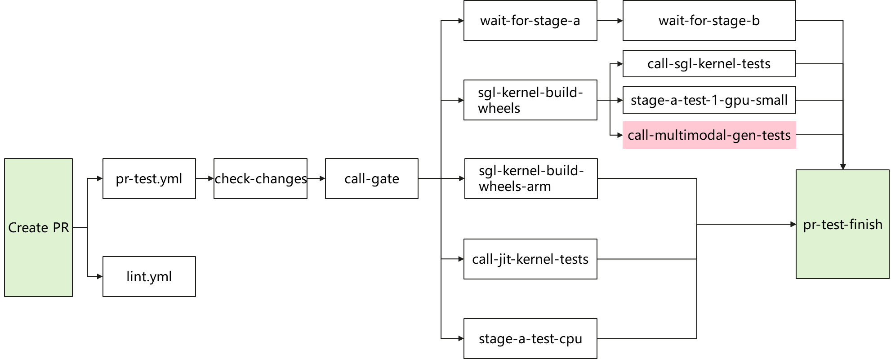

# 1. 创建PR后需要了解的CI常识

## 1.1. 触发CI
- 默认触发
  | 任务 (Job)            | 触发条件                                                | 修复/运行建议                                                                                                                                    |
  | :-------------------- | :------------------------------------------------------ | :----------------------------------------------------------------------------------------------------------------------------------------------- |
  | **lint**              | `main` 分支 PR 或 Push                                  | 本地预检，拷贝自lint.yml：<br>1. `pip install pre-commit`<br>2. `pre-commit install`<br>3. `SKIP=no-commit-to-branch pre-commit run --all-files` |
  | **check-changes**     | 创建 PR 时触发，但是定时任务或者rerun-stage命令不会触发 | NA                                                                                                                                               |
  | **coverage-overview** | 修改 `test/registered` 或 `ci_coverage_report.(py/yml)` | TODO                                                                                                                                             |

- 手动触发
  > 一定要养成查看CI日志的习惯，确保真的是CI环境的问题而不是代码问题。同时最好是24h内rebase一次

  | 类别     | 操作                                                                            |
  | -------- | ------------------------------------------------------------------------------- |
  | 有CI权限 | 1. `/tag-and-rerun-ci`第一次运行CI<br>2. `/rerun-failed-ci`运行部分flaky的CI    |
  | 无CI权限 | 1. 联系 `CI_PERMISSIONS.json` 用户触发<br>2. 多贡献PR加入 `CI_PERMISSIONS.json` |

## 1.2. 合入PR

- 所有CI通过

  根据 `CODEOWNERS` 文件找到对应的用户approved和merge
- 跟PR无关的CI问题阻塞PR合入

  根据 `MAINTAINER.md` 文件找对应的 `Merge Oncalls`，Ascend NPU的可以联系我（github id: [ping1jing2](https://github.com/ping1jing2) ）

# 2. 以SGL-Diffusion为例简述CI运行逻辑

## 2.1. overview


这里有几个问题：
- `lint.yml` 失败了可以early-stop，但是目前没有
- `sgl-kernel-build-wheels-arm` 好像无用可以删掉
- `wait-for-stage-a` 应该是依赖 `sgl-kernel-build-wheels` 完成似乎更合理


## 2.2. 用例分区

一般来说，CI用例需要足够多才可以看护更多场景，同时，CI用例运行时间足够短才能提升开发者体验。为了解决这个问题， `compute_diffusion_partitions.py` 专门用来为 diffusion CI 测试计算动态分区，其大概逻辑如下：

1. 在 `collect_diffusion_suites` 函数中使用 `AST` 库从源码中提取测试用例
  
    用例来源主要是 `run_suite.py` 中的 **STANDALONE_FILES** 和 `gpu_cases.py` 中的 **ONE_GPU_CASES** 和 **TWO_GPU_CASES**

2. 并使用 LPT（Longest Processing Time）算法将测试分配到各个partition，并保证每个partition的运行时长尽量均衡
3. 分区结束，可以调用测试脚本执行用例了。可点击下面用例供参考分区后的结果
    <details>

    <summary>Diffusion Partition Computation Example</summary>

    ```shell
      === Diffusion Partition Computation ===
      Min partition time: 1200.0s (20.0 min)
      Target partition time: 1800.0s (30.0 min)
      Max partition time: 2400.0s (40.0 min)

      1-GPU suite:
        Cases: 27
        Standalone files: 3
        Missing standalone estimates: 0
        Total estimated time: 4654.4s (77.6 min)
        Selected partitions: 3

        Partition assignments:
          Partition 0:
            Estimated time: 1526.1s (25.4 min)
            - standalone: test_update_weights_from_disk.py (480.0s)
            - case: flux_2_image_t2i (145.2s)
            - case: qwen_image_edit_2511_ti2i (143.7s)
            - case: fast_hunyuan_video (131.8s)
            - case: wan2_1_t2v_1.3b (129.3s)
            - case: wan2_1_t2v_1.3b_upscaling_4x (129.3s)
            - case: fastwan2_2_ti2v_5b (125.2s)
            - case: zimage_image_t2i (121.1s)
            - case: flux_2_klein_image_t2i (120.5s)
          Partition 1:
            Estimated time: 1520.1s (25.3 min)
            - case: flux_2_t2i_customized_vae_path (300.0s)
            - case: qwen_image_layered_i2i (161.5s)
            - case: qwen_image_edit_ti2i (153.6s)
            - case: ltx_2_3_hq_pipeline (144.2s)
            - case: qwen_image_t2i (133.1s)
            - case: wan2_1_t2v_1.3b_frame_interp_2x_upscaling_4x (129.4s)
            - case: wan2_1_t2v_1.3b_text_encoder_cpu_offload (129.3s)
            - case: wan2_1_t2v_1.3b_teacache_enabled (126.0s)
            - case: layerwise_offload (122.0s)
            - case: zimage_image_t2i_fp8 (121.0s)
          Partition 2:
            Estimated time: 1608.2s (26.8 min)
            - standalone: ../cli/test_generate_t2i_perf.py (240.0s)
            - case: flux_2_ti2i (168.9s)
            - case: qwen_image_edit_2509_ti2i (160.2s)
            - case: flux_2_image_t2i_upscaling_4x (145.1s)
            - case: wan2_2_ti2v_5b (141.7s)
            - case: wan2_1_t2v_1_3b_lora_1gpu (129.6s)
            - case: wan2_1_t2v_1.3b_frame_interp_2x (129.3s)
            - case: flux_image_t2i (127.4s)
            - case: qwen_image_t2i_cache_dit_enabled (124.9s)
            - case: zimage_image_t2i_multi_lora (121.1s)
            - standalone: test_tracing.py (120.0s)

      2-GPU suite:
        Cases: 22
        Standalone files: 1
        Missing standalone estimates: 0
        Total estimated time: 4898.9s (81.6 min)
        Selected partitions: 3

        Partition assignments:
          Partition 0:
            Estimated time: 1632.3s (27.2 min)
            - standalone: test_disagg_server.py (600.0s)
            - case: wan2_2_i2v_a14b_2gpu (264.1s)
            - case: wan2_2_t2v_a14b_2gpu (204.3s)
            - case: wan2_1_t2v_14b_2gpu (173.2s)
            - case: ltx_2.3_one_stage_ti2v (144.2s)
            - case: flux_image_t2i_2_gpus (125.5s)
            - case: zimage_image_t2i_2_gpus (121.0s)
          Partition 1:
            Estimated time: 1634.5s (27.2 min)
            - case: mova_360p_ring1_uly2 (300.0s)
            - case: wan2_2_t2v_a14b_teacache_2gpu (300.0s)
            - case: wan2_1_i2v_14b_720P_2gpu (248.9s)
            - case: ltx_2.3_two_stage_t2v_2gpus (216.7s)
            - case: wan2_2_t2v_a14b_lora_2gpu (181.8s)
            - case: qwen_image_t2i_2_gpus (133.2s)
            - case: ltx_2_two_stage_t2v (133.1s)
            - case: flux_2_klein_ti2i_2_gpus (120.8s)
          Partition 2:
            Estimated time: 1632.1s (27.2 min)
            - case: mova_360p_tp2 (300.0s)
            - case: zimage_image_t2i_2_gpus_non_square (300.0s)
            - case: wan2_1_i2v_14b_lora_2gpu (248.2s)
            - case: wan2_1_i2v_14b_480P_2gpu (243.0s)
            - case: ltx_2_3_two_stage_ti2v_2gpus (155.3s)
            - case: flux_2_image_t2i_2_gpus (135.3s)
            - case: wan2_1_t2v_1.3b_cfg_parallel (127.6s)
            - case: fsdp-inference (122.7s)
    ```

    </details>

## 2.3. 用例执行

`run_suite.py` 文件负责Diffusion所有测试套运行，可以从代码中清晰的看出来

```python
FILE_SUITES = {
    "unit": _discover_unit_tests(),
    "component-accuracy": [
        "test_component_accuracy_1_gpu.py",
        "test_component_accuracy_2_gpu.py",
    ],
    "component-accuracy-1-gpu": [
        "test_component_accuracy_1_gpu.py",
    ],
    "component-accuracy-2-gpu": [
        "test_component_accuracy_2_gpu.py",
    ],
    "1-gpu-b200": [
        "test_server_b200.py",
    ],
}

PARAMETRIZED_CASE_GROUPS = {
    "1-gpu": [
        ("test_server_1_gpu.py", ONE_GPU_CASES),
    ],
    "2-gpu": [
        ("test_server_2_gpu.py", TWO_GPU_CASES),
    ],
}

COMPONENT_ACCURACY_SUITES = {
    "component-accuracy",
    "component-accuracy-1-gpu",
    "component-accuracy-2-gpu",
}


def main():
    args = parse_args()
    validate_standalone_file_est_times()
    test_root_dir = Path(__file__).resolve().parent
    target_dir = test_root_dir / args.base_dir

    if not target_dir.exists():
        print(f"Error: Target directory {target_dir} does not exist.")
        sys.exit(1)

    if args.suite in COMPONENT_ACCURACY_SUITES:
        # Code omitted. This part has not been extracted into a standalone function.
        ...
    elif args.suite in PARAMETRIZED_CASE_GROUPS:
        exit_code = _run_dynamic_suite(args, target_dir)
    else:
        exit_code = _run_file_suite(args, target_dir)

    sys.exit(exit_code)


if __name__ == "__main__":
    main()
```

### 2.3.1. diffusion-coverage-check

1. 用例执行过程中每个partition都会调用 `run_suite.py :: write_execution_report` 生成 `execution_report_{suite}_{partition_id}.json` 文件
2. 然后由 `pr-test-multimodal-gen.yml :: Upload execution report` 上传作为 `pr-test-multimodal-gen.yml :: diffusion-coverage-check` 的输入。
3. `verify_diffusion_coverage.py` 首先调用 `collect_diffusion_suites` 函数生成所有预期的测试用例，然后解析 `Upload execution report` 的结果进行对比，最后计算用例覆盖率的结果。

<details>

<summary>A complete example of diffusion-coverage-check</summary>

```shell
  ============================================================
  Diffusion CI Coverage Verification
  ============================================================

  Loaded 6 execution reports

  Expected cases by suite:
    1-gpu: 28 cases
    2-gpu: 23 cases

  Executed cases by suite:
    1-gpu: 28 cases
    2-gpu: 23 cases

  ============================================================
  ✅ COVERAGE: 100% - All test cases executed
  ============================================================

  ============================================================
  Test Results Summary
  ============================================================
    Total executed: 51
    ✅ Passed: 48
    ❌ Failed: 3

  Failed cases:
    2-gpu:
      - ltx_2.3_two_stage_t2v_2gpus
      - ltx_2_3_two_stage_ti2v_2gpus
      - ltx_2_two_stage_t2v

  ============================================================
  ⚠️  WARNING: Some tests failed but coverage is complete
  ============================================================
```
</details>
