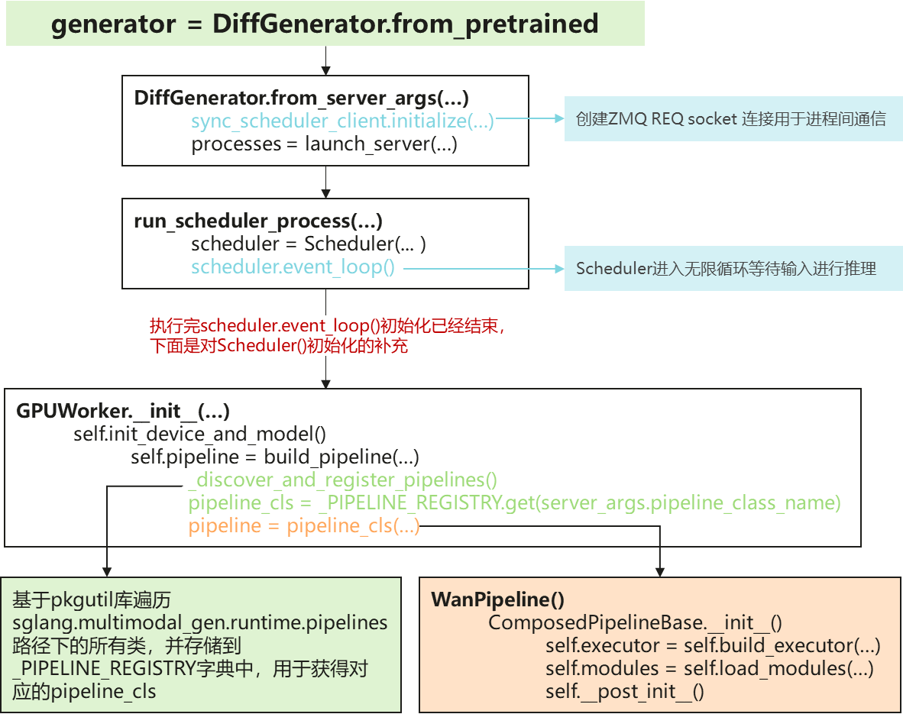
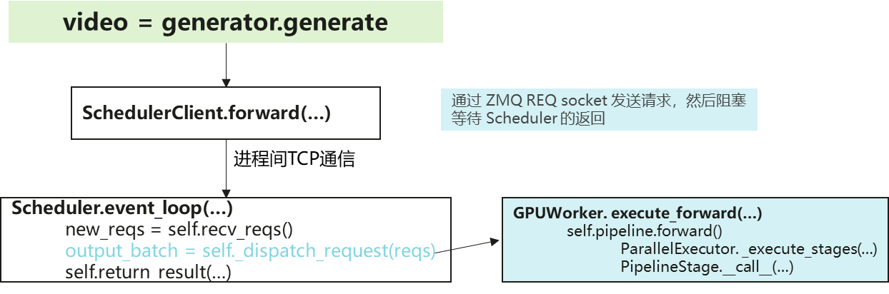

# 写在前面

> 对于用户而言，建议通过 [SGLang Diffusion官网文档](https://docs.sglang.io/docs/sglang-diffusion) 或者 [SGLang Diffusion Cookbook](https://docs.sglang.io/cookbook/diffusion/intro) 获取所有你需要的信息。如果资料有问题欢迎提 [issue](https://github.com/sgl-project/sglang/issues) ，Ascend NPU的可以 @[ping1jing2](https://github.com/ping1jing2)。

开发者在开始编码之前一定要阅读 [contribution](https://docs.sglang.io/docs/sglang-diffusion/contributing) ，不过我这里还是把一些我认为重要的信息再罗列一下。

- Commit Message

  - format
    ```text
    # common format
    [diffusion] <scope>: <subject>

    # examples
    [diffusion] cli: add --perf-dump-path argument
    [diffusion] scheduler: fix deadlock in batch processing
    [diffusion] model: support Stable Diffusion 3.5
    ```
  - **Rules:**
    - **Prefix**: Always start with `[diffusion]`.
    - **Scope** (Optional): `cli`, `scheduler`, `model`, `pipeline`, `docs`, etc.
    - **Subject**: Imperative mood, short and clear (e.g., "add feature" not "added feature").

- 针对新模型或者性能优化相关PR需要补充性能报告

  ```bash
  # 1. 运行PR修改前的benchmark命令
  $ sglang generate --model-path <model> --prompt "A benchmark prompt" --perf-dump-path baseline.json

  # 2. 运行PR修改后的benchmakr命令
  $ sglang generate --model-path <model> --prompt "A benchmark prompt" --perf-dump-path new.json

  # 3. 性能结果对比
  $ python python/sglang/multimodal_gen/benchmarks/compare_perf.py baseline.json new.json [new2.json ...]
  ### Performance Comparison Report
  ###...

  # 4. 把对比结果粘贴到PR description或者comment中
  ```

# 一段代码理解SGL-Diffusion运行逻辑

## 代码样例
```python
"""
Equivalent CLI command

sglang generate \
--model-path Wan-AI/Wan2.1-T2V-1.3B-Diffusers\
--text-encoder-cpu-offload --pin-cpu-memory\
--prompt "A curious raccoon"\
--save-output
"""

from sglang.multimodal_gen import DiffGenerator

def main():
    # Create a diff generator from a pre-trained model
    generator = DiffGenerator.from_pretrained(
        model_path="Wan-AI/Wan2.1-T2V-1.3B-Diffusers",
        num_gpus=1,  # Adjust based on your hardware
    )

    # Generate the video
    video = generator.generate(
        sampling_params_kwargs=dict(
            prompt="A curious raccoon peers through a vibrant field of yellow sunflowers, its eyes wide with interest.",
            return_frames=True,  # Also return frames from this call (defaults to False)
            output_path="my_videos/",  # Controls where videos are saved
            save_output=True
        )
    )

if __name__ == '__main__':
    main()
```

## `generator = DiffGenerator.from_pretrained` 软件堆栈



对于开发者而言，只有 `WanPipeline` 是需要关注的

- `load_modules`

  如果用去餐厅吃饭来比喻的话，这个步骤就是在顾客先点菜（模型厂商提供的 `model_index.json` 是菜单），然后大堂经理通知餐厅后厨备菜，如果食材没有了再反馈给顾客（ `load_component` 加载所有的模型并进行合法性校验）。具体来说：
  - 解析 `model_index.json` 文件得到 `model_index` 变量

    以 [Wan-AI/Wan2.1-T2V-1.3B-Diffusers/model_index.json](https://huggingface.co/Wan-AI/Wan2.1-T2V-1.3B-Diffusers/blob/main/model_index.json) 为例，得到的结果是 `model_index.keys() = ["text_encoder", "tokenizer", "vae", "transformer", "scheduler"]`

  - 遍历 `model_index` 逐一加载相应模型，`module, memory_usage = PipelineComponentLoader.load_component(...)`

    1. `loader = ComponentLoader.for_component_type(...)` 

        根据 `component_name` 入参从 `component_name_to_loader_cls` 字典中得到对应的 `loader` 对象。值得提一下的是，`component_name_to_loader_cls` 定义在 `loader/utils.py` 中，真正更新是 `loader/component_loaders/component_loader.py::ComponentLoader::__init_subclass__`，使用是在这里，有点奇怪。

    2. `loader.load(...)`

        这里没有太多特别的，主要是先初始化模型 `model_cls, _ = ModelRegistry.resolve_model_cls(...)`， 然后加载权重 `loaded_weights = model.load_weights(...)`

- `__post_init__`

   还是以去餐厅吃饭来比喻，现在需要确定的是上菜顺序（这里叫做 `pipeline` ），这个必须是客人决定（所以**必须实现** `create_pipeline_stages`）。当然，餐馆也会给出比如 冷菜-主菜-青菜-水果 这样的推荐（代码中有 `add_standard_t2i_stages` ，`add_standard_ti2i_stages` 和 `add_standard_ti2v_stages` 可供开发者直接调用）。

## 详解 `video = generator.generate`



- 关于reqs的一些QA
  > 下面是我在源码学习中的一些疑惑和难点，记录并分享给大家。

  Q1: 为什么 `new_reqs` 用 `tuple[bytes, Any]` 而非直接传 `Req`？

  A1：因为 ZMQ库socket限制**必须用 identity 回复客户端**，所以 `tuple[bytes, Any]` 中的 `bytes` 是**路由回信地址**，`Any` 是**实际请求内容**。warmup 请求不需要回复（identity 为 `None`），所以 `return_result` 中有 `identity is not None` 的判断。

  Q2：如何理解 `recv_reqs()` 中的if-else分支

  A2：因为发送端有两种类型的请求，一类是通过 `DiffGenerator._send_to_scheduler_and_wait_for_response` 发送的生成请求，一类是通过 `DiffGenerator._send_lora_request` 发送的控制请求
